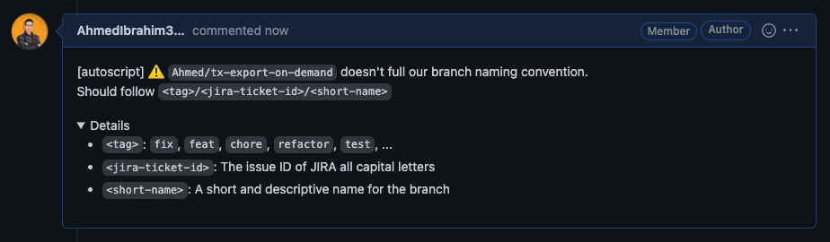
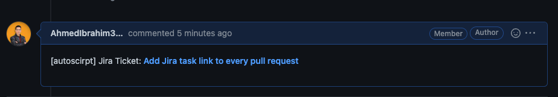

# Jira Ticket

Link GitHub pull requests with its associated Jira task.

## How it works

The web server exposes a single endpoint `/api/v1/pull/:pullId` that accepts the pull request Id (Normally will be from the CI/CD) and will do the following.

1. The script will make sure the branch name is following the branch naming
   convention `<tag>/<jira-ticket-id>/<short-summary>`. If the branch doesn't
   follow the conditions, a comment similar to the one below will be made.

   

2. f the branch name is valid a comment will be made with the associated Jira
   ticket.

   
